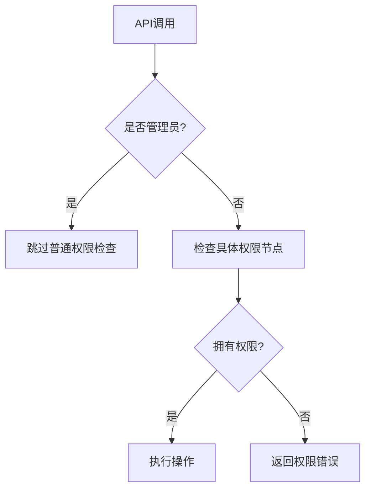

### 权限配置文件

```yml
permissions:
  swiftcrate.*:
    description: 授予所有仓库权限
    children:
      swiftcrate.create: true
      swiftcrate.delete: true
      # ...其他权限节点
    default: false
  
  swiftcrate.user:
    description: 基础用户权限
    children:
      swiftcrate.create: true
      swiftcrate.view.self: true
      swiftcrate.item.deposit: true
      swiftcrate.item.withdraw: true
    default: true

  swiftcrate.admin:
    description: 仓库管理员
    children:
      swiftcrate.delete.others: true
      swiftcrate.view.others: true
      swiftcrate.capacity.set: true
    default: op
```


#### 权限验证流程




